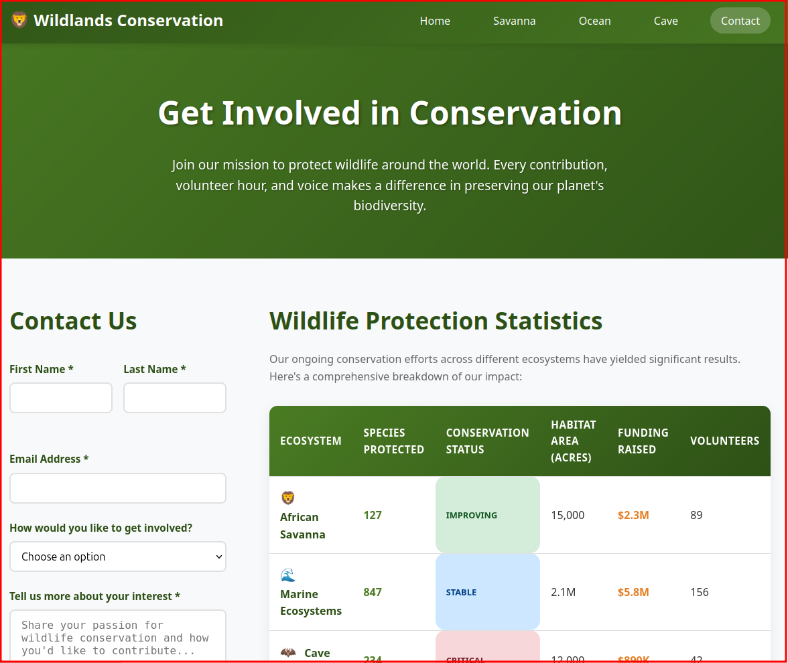

# Lab Instructions - Animation Debug

## 🌟 Getting Started

**Explore the working version first:**
- Open `solutions/index-solution.html` and navigate through all solution pages
- Experience the smooth animations and professional interactions
- **This is your target** - elegant, accessible, and engaging pages

**Then examine the broken version:**
- Open `student-files/index.html` and navigate to see the issues
- **Your mission**: Transform the disasters into polished, working animations

**Time allocation**: 4 hours total. Focus on investigation and understanding _why_ solutions work, not just copying them.

## 📁 File Organization Guide

The lab directory contains everything you need:

### 🚧 Your Working Files
- **`student-files/`** - This is where you'll do ALL your work
  - `index.html` - Homepage (start here)
  - `savanna.html`, `ocean.html`, `cave.html`, `contact.html` - Other pages to debug
  - `styles/` directory - All the CSS files you need to fix

### ✅ Reference Solutions  
- **`solutions/`** - Working versions for comparison (use sparingly!)
  - `index-solution.html` - Perfect homepage to reference
  - Other `*-solution.html` files - Working versions of each page
  - `styles/` directory - Fixed CSS files for reference

### 🎨 Shared Resources
- **`../assets/images/`** - All images and graphics (don't modify these)

**Important**: Always work in the `student-files` directory. Only look at solutions when you're truly stuck!

---

## 🛠️ Developer Tools Survival Guide

Before diving into specific bugs, master these essential debugging techniques that will serve you throughout this lab (and your career!):

### 🧠 The Debugging Mindset

**Don't guess - investigate!** When something looks wrong:

1. **Observe first**: What exactly is different from what you expect?
2. **Form hypotheses**: What could cause this behavior?
3. **Test systematically**: Use dev tools to confirm or reject your theories
4. **Fix incrementally**: Change one thing at a time and test the result

### 🔍 Essential Dev Tools Techniques

**Elements Panel - Your CSS Detective Tool:**

- Right-click any broken element → "Inspect Element"
- Look for crossed-out CSS properties (they're being overridden)
- Check if animations/transitions are applied but not working
- Toggle CSS properties on/off to test theories
- **Pro tip**: Hover over CSS colors to see if they're visible on the background

**Network Panel - Understanding What's Actually Loading:**

- Open Network tab, refresh the page
- Filter by "CSS" to see all stylesheets loading
- Look for 404 errors (red entries) - missing files!
- Click file names to preview their contents
- **Key question**: Are the files you expect actually loading?

**Console Panel - Catching Silent Errors:**

- Red errors often reveal broken JavaScript or missing resources
- Yellow warnings might indicate accessibility or resource issues
- **Pro tip**: If a form isn't working, check here for JavaScript errors

**Animations Inspector - Making Motion Visible:**

- Look for "Animations" panel in dev tools (might be hidden under >> button)
- Refresh the page and watch for animation timeline bars
- No animations showing = animation names don't match @keyframes
- **Pro tip**: Slow down animations to see what's actually happening

### 🕵️ Common Investigation Patterns

**When Text Is Unreadable:**

- Elements panel → Check the color values of text vs background
- **Quick test**: Try changing the text color to bright red - can you see it now?
- Look for inheritance issues - is the color coming from a parent element?

**When Hover Effects Are Broken:**

- Elements panel → Force hover state with ":hov" button
- Check if :hover rules exist and aren't being overridden
- **Quick test**: Add `background: red !important` to :hover rule - does anything change?

**When Layouts Look Wrong:**

- Elements panel → Box model diagram shows actual spacing
- Look for missing grid/flexbox properties
- Check if containers have proper structure (missing wrapper divs?)

**When Animations Don't Work:**

- Animation inspector → Are any animations actually running?
- Elements panel → Check animation property names
- Network panel → Are CSS files with @keyframes actually loading?
- **Quick test**: Try `animation: fadeInUp 1s ease` - does the name get recognized?

### 🎯 Pro Debugging Tips

- **Change one thing at a time** - don't fix multiple bugs simultaneously
- **Use bright colors for testing** - `background: red` makes problems obvious
- **Check the Console** - many visual bugs are caused by JavaScript errors
- **Refresh often** - CSS changes don't always update without a refresh
- **Mobile responsive issues** - use device toolbar to test different screen sizes

---

## 🔍 Investigation Techniques

When you encounter an animation that isn't working, try these systematic approaches:

<strong>🎬 Animation Inspector Method</strong>

1. Right-click on an element that should be animating
2. Select "Inspect Element"
3. In the Developer Tools, look for the **"Animations"** panel (you might need to click the >> button to find it)
4. Refresh the page while watching the Animations panel
5. **What you should see**: Active animations appear as timeline bars
6. **What indicates a problem**: No animations appear, or animations have error indicators

**Key Questions to Ask:**

- Are any animations showing up in the panel?
- Do the animation names match what's defined in the CSS?
- Are the timing and delays what you expect?

<strong>🔍 Elements Panel CSS Investigation</strong>

1. Inspect the element that should be animating
2. In the **Elements** panel, look at the **Styles** section on the right
3. Find the CSS rules for animation properties
4. **What to check**:
   - Is the `animation` property present and not crossed out?
   - Does the animation name match a `@keyframes` rule?
   - Are there any error indicators (yellow warnings, red X's)?

**Common Problems to Look For:**

- Animation name doesn't match any `@keyframes` definition
- Animation properties are overridden by more specific selectors
- Typos in animation names or keyframe names

<strong>🌐 Network Panel for Understanding File Structure</strong>

**Pre-Debug Activity**: Before diving into animation fixes, use the Network tab to map out which CSS files are actually loading on the homepage.

1. Open Developer Tools and go to the **Network** tab
2. Refresh the page
3. Filter by CSS files (click the "CSS" button in the Network panel)

**Discovery Questions:**

- How many CSS files are loading on the homepage?
- What are their names? (Write them down!)
- Are they all loading successfully (200 status codes)?
- Are there any 404 errors for missing files?

**Investigation Task**: Click on each CSS file name to preview its contents. Can you figure out:

- Which file contains the main site-wide styles (navigation, buttons, etc.)?
- Which file contains homepage-specific styles (hero section, stats, habitat cards)?
- Where do you think the `@keyframes` animations are defined?

**Why This Matters**: When animations break, you need to know which files to investigate. The Network tab shows you the actual files being loaded, not just what's linked in the HTML!

---

## 🚨 URGENT: Critical Bug Fixes Needed

The Wildlands Conservation website is broken just hours before tomorrow's major donor presentation! The development team is counting on you to identify and fix the critical issues that are preventing the site from making the impact it needs.

**Your Mission**: Debug and fix animation and interaction issues across the conservation site. Use your developer tools investigation skills to identify problems and implement solutions.

---

## 🏠 Homepage (START HERE - High Priority)

**Problems Reported by the Marketing Team:**

### Animation Issues

- **Hero section feels static**: The main content should smoothly slide in from the left when the page loads, but nothing is happening
- **Stats section lacks impact**: The impact numbers (2,500 animals, etc.) should animate in with a staggered delay, but they just appear immediately
- **Habitat cards don't flow in**: The conservation area cards should fade up one by one, but they all appear at once

### Interactive Disasters

- **Navigation feels jarring**: The navigation links should smoothly transition when hovered, but they snap between states
- **Donate button text disappears**: The primary button text becomes completely invisible when hovered
- **Secondary button jumps**: The "Learn More" button feels jarring when interacted with
- **Hero image goes crazy**: The main elephant image spins and flies off screen when hovered
- **Habitat cards rocket away**: Conservation area cards flip upside down and shoot off screen when hovered

### Content Issues

- **Images not loading**: The wildlife images are showing as broken image icons instead of the beautiful conservation photos
- **Section heading invisible**: The "Explore Our Conservation Areas" heading can't be seen
- **Habitat descriptions unreadable**: The text describing each habitat is nearly invisible

### Navigation Behavior Issues

- **Links opening incorrectly**: Some navigation links are opening in new tabs when they should stay in the same window, creating a confusing user experience

---https://github.com/onja-org/w2_css_animation_debug.git

## ✅ When You've Fixed the Homepage

Once the homepage animations are flowing smoothly and all interactions feel polished:

1. **Test your fixes**: Refresh the page multiple times to ensure animations work consistently
2. **Check responsive behavior**: Try different browser window sizes
3. **Verify navigation**: Make sure all links behave as expected (same tab vs. new tab)

**Then proceed to**: Choose your next debugging challenge from the conservation areas below!

---

## 🦁 Additional Conservation Areas (Choose Your Next Challenge)

### 🦁 Savanna Section

**What's Obviously Broken:**

- **Layout collapsed**: All animal cards stacked in narrow column instead of grid
- **Cards fly away on hover**: Animal cards shoot off screen when you hover over them
- **Text invisible**: Headings and descriptions are unreadable (white/gray on white)
- **Status badges invisible**: All conservation status labels are same color as background

**Debugging Checklist:**

- [ ] Fix grid layout - animals should display in responsive grid
- [ ] Fix hover disasters - cards should lift gently, not fly away
- [ ] Fix text visibility - all text should be readable with good contrast
- [ ] Fix status badge colors - each status should have distinct, readable colors
- [ ] Fix navigation link targets - some open in wrong tab/window
- [ ] Fix hover interactions - images should scale smoothly, not jerk

### 🌊 Ocean Section

**What's Obviously Broken:**

- **All animations dead**: Fish aren't swimming, waves aren't moving, bubbles aren't floating
- **Layout disaster**: Species cards crammed into impossibly narrow columns
- **Hover disasters**: Cards disappear when hovered, images explode in size
- **Images missing**: All marine animal photos showing as broken image icons

**Debugging Checklist:**

- [ ] Fix fish swimming animations - all fish should move across the aquarium
- [ ] Fix wave animations - ocean waves should move smoothly
- [ ] Fix bubble floating animations - stats bubbles should gently float up and down
- [ ] Fix responsive layout - species cards should fit properly on all screen sizes
- [ ] Fix hover interactions - cards should lift, not disappear or explode
- [ ] Fix broken images - update file extensions from .jpg to .svg
- [ ] Fix coral/seaweed swaying - underwater plants should move gently

### 🦇 Cave Section

**What's Obviously Broken:**

- **Text completely invisible**: Almost all text is unreadable (dark text on dark backgrounds)
- **Navigation invisible**: Logo and links can't be seen
- **Critical info hidden**: Conservation status and important details are invisible
- **Animations frozen**: Bats aren't flying, stalactites aren't dripping, lights aren't flickering

**Debugging Checklist:**

- [ ] Fix text contrast - all text should be light colors on dark backgrounds
- [ ] Fix navigation visibility - logo and links should be clearly visible
- [ ] Fix section headings - all headings should stand out from backgrounds
- [ ] Fix info card text - descriptions and details should be readable
- [ ] Fix bat flying animations - bats should fly around the cave area
- [ ] Fix stalactite dripping - cave formations should move slightly
- [ ] Fix light flickering - cave lighting should create atmospheric effects
- [ ] Fix hover states - interactions should make things more visible, not less

### 📧 Contact Section

**What's Obviously Broken:**

- **Form disasters**: Buttons don't respond, inputs behave strangely
- **Data table chaos**: Wildlife data table has missing or broken structure
- **Validation mayhem**: Error messages appear in wrong places or not at all

**Debugging Checklist:**

- [ ] Fix form submission - contact form should respond to user interaction with a popup alert message
    - You don't know much about JavaScript, but see if you can figure out what's wrong! There are some hints in the HTML comments. If you can't figure this out, it's ok.
- [ ] Fix input styling - form fields should look and behave professionally
- [ ] Fix table structure - wildlife data should display in organized rows/columns
- [ ] Fix validation feedback - error states should be clear and helpful
- [ ] Fix button interactions - all buttons should have proper hover/click states

---

## 💡 General Debugging Tips

- **Start with the obvious**: Is the CSS file actually loading?
- **Check the console**: Are there any JavaScript or CSS errors?
- **Animation names are case-sensitive**: `fadeInUp` ≠ `fadeInup`
- **Timing matters**: Look for animation-delay and animation-duration conflicts
- **Cascade issues**: More specific selectors can override your animations

**Remember**: The goal isn't just to make it work, but to understand _why_ it wasn't working. Use the developer tools to investigate the root cause of each issue!

---

## 🎯 Quick Workflow Reminder

### Your Debugging Workflow:
1. **Open student files**: Always work in `student-files/` directory
2. **Compare with browser**: Open both broken and working versions side-by-side
3. **Use dev tools**: Inspect, investigate, hypothesize, test
4. **Fix incrementally**: One issue at a time, test after each change
5. **Reference solutions**: Only when truly stuck - compare your fixes with `solutions/`

### File Navigation Tips:
- **Main working file**: `student-files/index.html` (start here)
- **Your CSS files**: `student-files/styles/` (main.css, homepage.css, etc.)
- **Reference solutions**: `solutions/` (for comparison only)
- **Images**: `../assets/images/` (already configured, don't modify)

### Success Metrics:
✅ Smooth animations that enhance the experience  
✅ All text is readable with proper contrast  
✅ Hover effects feel polished, not jarring  
✅ Layouts work responsively on different screen sizes  
✅ Navigation behaves consistently  

---

_Good luck! The wildlife is counting on you to make this presentation a success._ 🦁🌍
